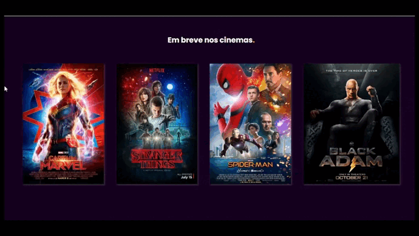

<br>

<h1 align="center">
  
</h1>

<br>

#### Cinemix se baseia em uma plataforma de cinema que simula o lado do administrador onde o mesmo poderá realizar os métodos:

-   GET = <i>Listar</i>
-   POST = <i>Adicionar</i>
-   PUT = <i>Editar</i>
-   DELETE = <i>Excluir</i>

## Recursos

> O sistema possui recursos para cadastrar, atualizar e remover filmes, combos e sessões.

 <br>

## Tema da API

> CINEMA

> API está em repositório separado e hospedada na VERCEL

<br>


## Endpoints

```bash
https://cinemix-api.vercel.app/filmes/
```

```bash
https://cinemix-api.vercel.app/combos/
```

```bash
https://cinemix-api.vercel.app/sessoes/
```



<br>

## Dependências

[Node.js](https://nodejs.org/en/)

[Json-Server](https://github.com/typicode/json-server) para o fake database em json.

<br>

## Uso

Clone o projeto

```bash
git clone https://github.com/nobrupsiq/cinemix-purejs
```

Entre no diretório do projeto

```bash
cd cinemix-purejs
```

Inicie o servidor

```bash
Rode o Live server
```

<br>

## ✔ Stack utilizada

-   **Front-end:** JavaScript

-   **Back-end:** Node, Json-Server

<br>

## Documentação de cores

| Cor    | Hexadecimal                                     |
| ------ | ----------------------------------------------- |
| Purple |  #6639DA |
| Orange |  #FDA529 |
| Black  |  #000000  |
| White  |  #ffffff  |

## Screenshots

<br>

## Feedback

Feedback siqueiracode@gmail.com
